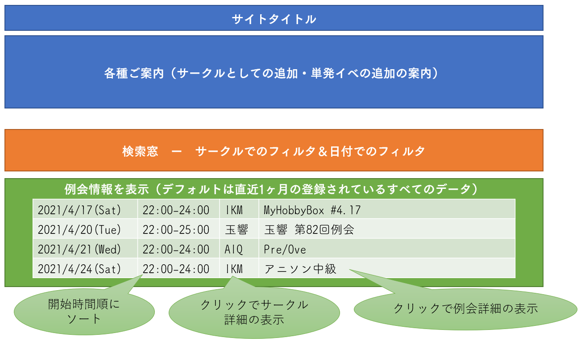

# Intro Quiz Portal Square "Azure"

Private repository

## 概要
* Googleカレンダーと連携、複数のイントロイベントを一括で見ることができる

## 機能
* 基本的にはカレンダーIDをJSONで一括管理し、そこに追加することでAppendする
    * 別途、Azure単発カレンダーを設ける。単発イベはここに追加。
    * JSONでは、以下の内容を扱う。
        * 略称(半角4/全角2程度上限) - カレンダー表示用
        * 正式名称 - サークル詳細表示用
        * サークル等概要 - サークル詳細表示用
        * Twitter - サークル詳細表示用(あれば)
        * 連絡先 - サークル詳細表示用(あれば)
* 一定時間ごと(要調整, 1hくらい?)にカレンダーを走査して、直近n件を取得。JSONとして保存する。
    * 要求に応じて、NoSQL的にJSONを使用し、データを取得。これによりGoogle Calender APIの使用回数を減らす。っていうか時間結構掛かる印象なんだよな。そこへの対応ってのもある。



## JSON

### circles.json

```json
{
    "simple": "AIQ", 
    "name": "AIQオンライン",
    "overview": "サークル概要",
    "twitter": "aiq_list",
    "contact": "xxx@example.com"
}
```

### events.json

